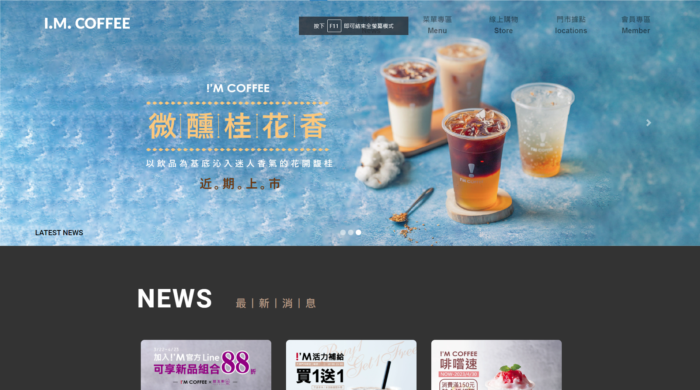
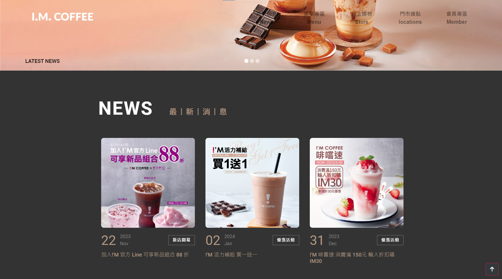
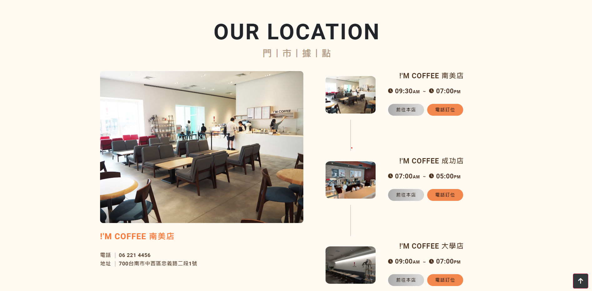
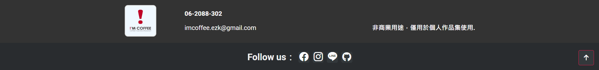

## 📣 此專案尚在開發中

➤  **網址：** [**I'M COFFEE**](https://lazydelon.pythonanywhere.com/)   

## 📋 待開發項目

|      |	**Project** |
| ---- | ---- |
| **01**	| **菜單專區 Menu** |
| **02**	| **線上購物 Store** | 
| **03**	| **會員專區 Member** |

## 🎓 帶修正項目

|      |	**Project** |
| ---- | ---- |
| **01**	| **Mobile phone board layout** |
| **02**	| **Latest news picture layout** |
| **03**	| **Home page store location layout** | 
| **04**	| **Navigation Bar Latest News Linked Page** |
| **05**	| **Navigation list store location link page** | 

## 📣 此專案主要是透過實體品牌去製作網頁

## **1. Initial page 初始頁面**

&nbsp; 

## **2. Home Page 首頁**

&nbsp; 

## **3. NewArea 最新消息**

&nbsp; 

## **4. Locations 門市據點**

&nbsp; 

## **5. Footer 關於我們**

&nbsp; 

## **6. Home Page 手機板 首頁**

&nbsp; 

## **7. NewArea 手機板 最新消息**

&nbsp; 
