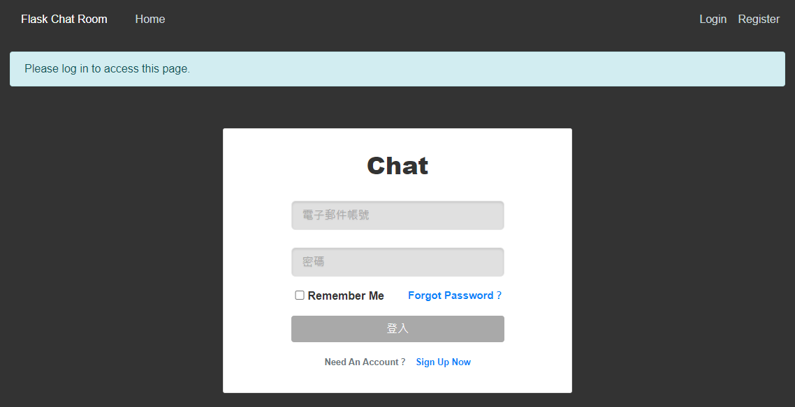
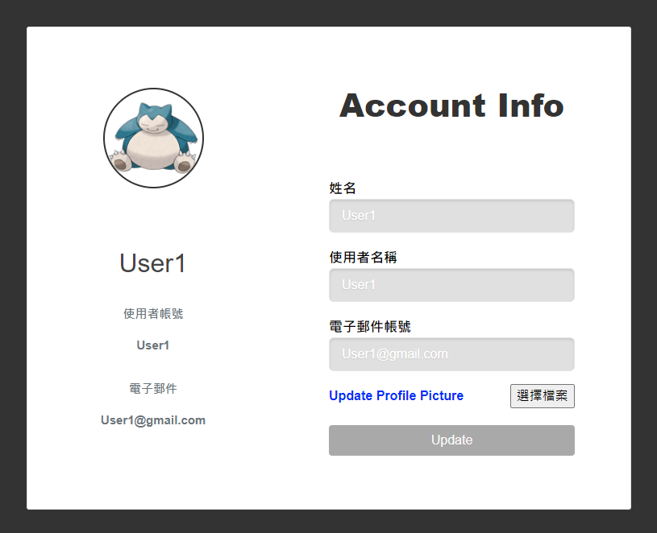
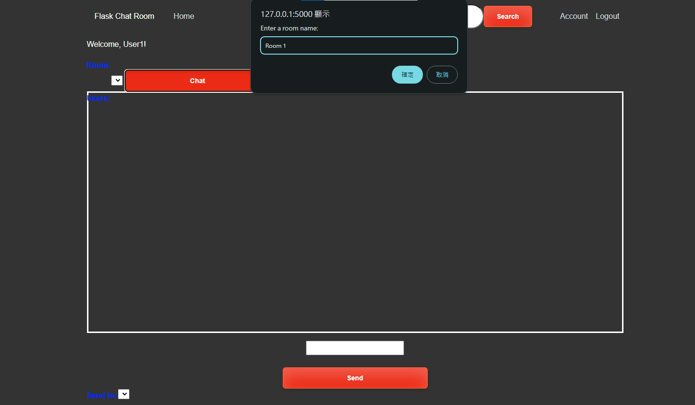
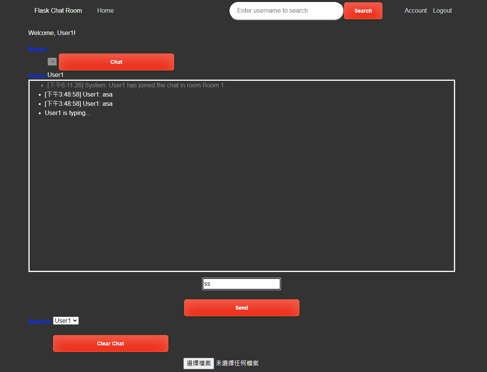

## 📣 此專案尚在開發中

### ！ 目前受到架設網站的影響，所以無法進行監聽，導致此網頁目前無法工作
#### ➤ 建議下載此專案自行執行

## **聊天室目前主要是透過使用所輸入的房間名稱 來分區**
### **1. 使用者進行註冊**
### **2. 使用者進行登入**
### **3. 使用者進行到 account.html 請先輸入姓名欄位 並點選 Update**
### **4. 點選 Chat Button 輸入房間名稱**
### **5. 在 input box 輸入訊息 並發送(send)**

### **0. 其餘功能：clear chat 清除訊息**
### **0. 其餘功能：Upload File 尚未開發完成(讓使用者能發送圖片)**

➤  **網址：** [**Flask Chat Room**](https://s108000395.pythonanywhere.com/login?next=%2F)

## 📋 待開發項目

|      |	**Project** |
| ---- | ---- |
| **01**	| **Search Box 收尋頁面** |
| **02**	| **好友功能** | 
| **03**	| **房間設定(可邀請好友)** | 
| **04**	| **結合 GUI or exe** |

## 🎓 帶修正項目

|      |	**Project** |
| ---- | ---- |
| **01**	| **聊天室版面** |
| **02**	| **聊天室圖片功能** |
| **03**	| **聊天室房間設定** | 
| **04**	| **聊天室回訊息時顯示用戶頭貼** | 

## 📣 

## **1. Login 登入頁面**

&nbsp; 

## **2. Register 註冊頁面**

&nbsp; 

## **3. Account 帳戶資訊**

&nbsp; 

## **4. Room 房間設定**

&nbsp; 

## **5. Enter Message 輸入訊息**

&nbsp; 

