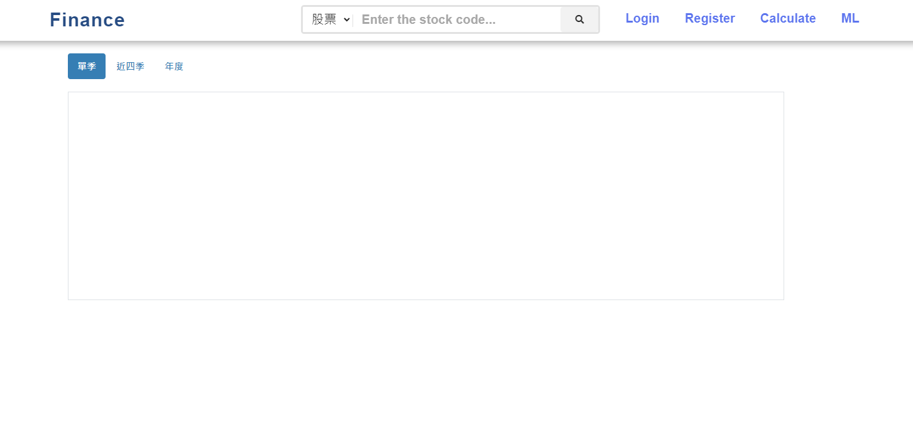

## 📣 此專案尚在開發中 (大學專題)

**此網址版面與執行端有所差異，不確定是否是 pythonanywhere 託管的問題。**
**但功能完整，若覺得網址介面太亂 建議下載檔案自行執行**

➤  **網址：** [**Finance Web**](https://zxc884162.pythonanywhere.com/)

## 📋 網頁實際頁面

**1. Home Page 首頁**

&nbsp; 

**2. Finance Report 財報**

&nbsp; 

**3. Finance Category 類別**

&nbsp; 

**4. 機器學習**

&nbsp; 

**5. 正負樣本**

&nbsp; 
